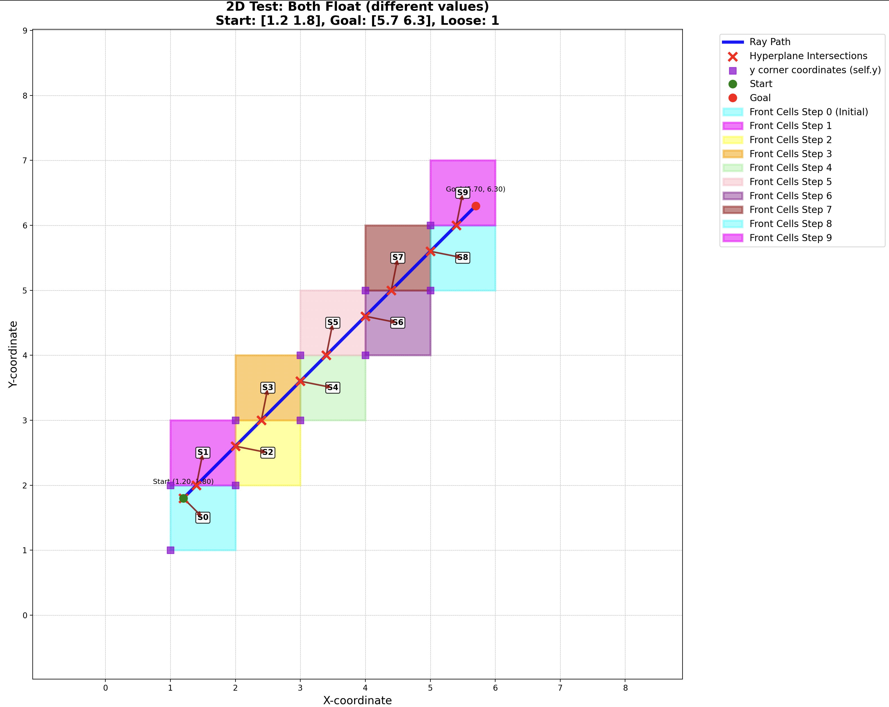
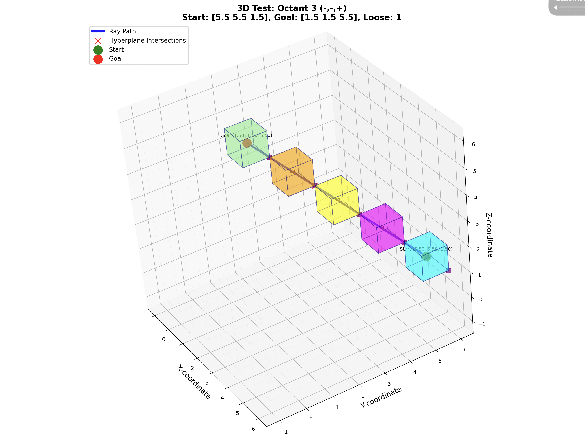

# N-Dimensional-Fast-Voxel-Traversal

This project implements an N-dimensional fast voxel traversal algorithm, a method for efficiently determining which voxels a ray intersects in a grid. The implementation is builds on the paper "A Fast Voxel Traversal Algorithm for Ray Tracing" by John Amanatides and Andrew Woo. This algorithm has been modified from the paper with advice from Dr Lai Yan Kai.

## Project Structure

*   `main.py`: This is the main entry point of the application. It contains a comprehensive test suite for 2D and 3D scenarios.
*   `n_dimensional_fast_voxel_traversal.py`: This file contains the core logic for the ray traversal algorithm, including classes for the base ray tracer, obstacle handling, and visualization.
*   `plotting.py`: This file contains functions for visualizing the 2D and 3D ray tracing results using Matplotlib.

## Key Concepts

### Front Cells

In the context of this voxel traversal algorithm, "front cells" refer to the set of voxels that the ray is about to enter. At each step of the traversal, the algorithm identifies the next hyperplane (a line in 2D, a plane in 3D) that the ray will cross. The front cells are the voxels that lie on the other side of this hyperplane, in the direction of the ray's travel.

The visualization plots these front cells at each step, showing how the algorithm progresses through the grid. This is crucial for obstacle detection, as the algorithm checks if any of the front cells are occupied by an obstacle before advancing the ray.

## How to Run

1.  **Prerequisites:** Make sure you have Python 3 and the following libraries installed:
    *   `numpy`
    *   `matplotlib`

    You can install them using pip:
    ```bash
    pip install numpy matplotlib
    ```

2.  **Running the tests:** To run the test suite and generate visualizations, simply execute the `main.py` file:
    ```bash
    python main.py
    ```
    This will run a series of pre-defined 2D and 3D test cases and display the results as plots. You can uncomment or modify the tests in `main.py` to experiment with different scenarios.

## Screenshots

### 2D Test Cases




### 3D Test Cases


